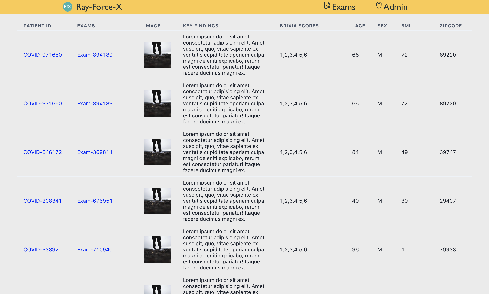
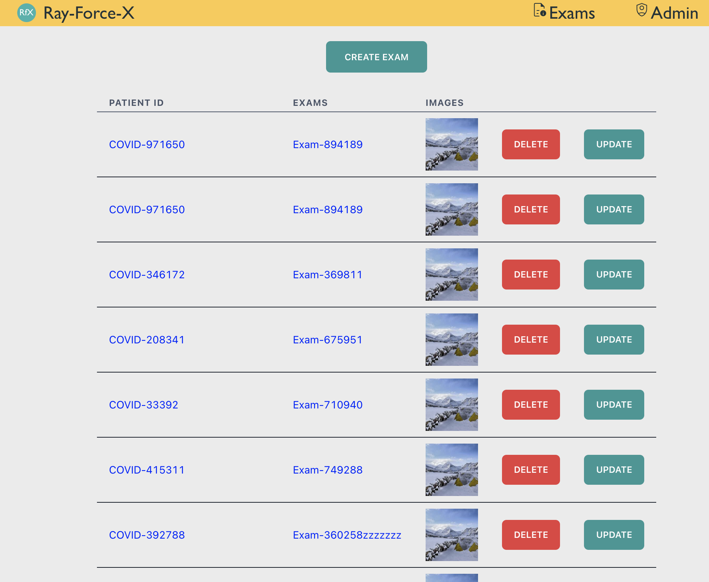
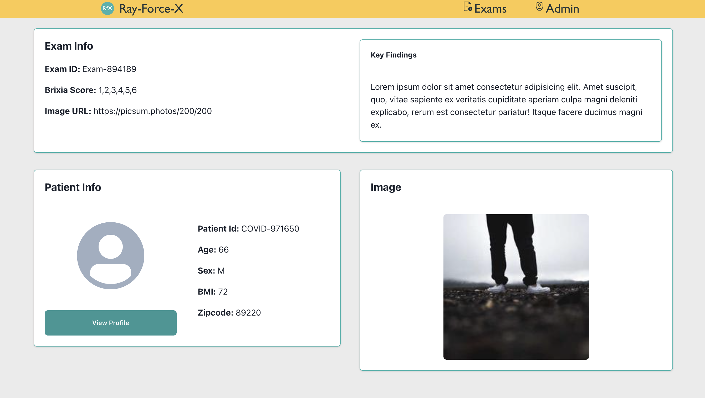
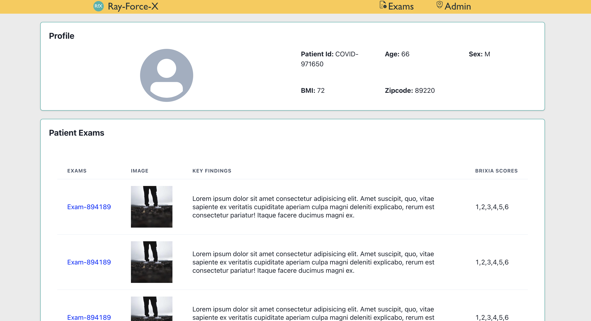

# Tech Dive 2024

## Welcome !

[app name] is a web application that allows doctors to read and manage structured radiology reports as an assessment of x-ray images for exams of patients with COVID-19.

One of the tools used by doctors to assess the condition of patients with COVID-19 is an x-ray, which creates an image of the patient’s organs and structures within their body. This can help visualize infections such as pneumonia within a patient’s lungs. After performing an x-ray, doctors need a way to record information about what they discovered, so that they can look back at it.

# Images

## <p style="text-align: center;">Exams Index Page</p>
### 
## <p style="text-align: center;">Administration Page</p>
### 
## <p style="text-align: center;">Exam Details Page</p>
### 
## <p style="text-align: center;">Patient Portal</p>
### 

# Getting started
This project contains two different applications:
 * a front end, or "client," created with "Create React App," 
 * a back end, or "API," created with Express.


## Client
In order to run the client, you'll run the following terminal commands from the root folder:

```bash
cd client/
npm i
npm start
```

You should then be able to visit `localhost:3000` in your browser and see the client running. 

## API
In order to run the server, you'll run the following commands:

```bash
cd api/
npm i
npm start
```

You should then be able to visit `localhost:9000` in your browser and see the server running.


### This application uses the following technologies
### Frontend

* React
   - Chakra UI
   - Framer Motion
   - Three.js
* Node.js
* HTML / CSS

### Backend
* MongoDB
   - Mongoose
* Express
* Node.js
* AWS 

# CRUD Features

## User
Allows you to:
   - Log in
   - Sign up
   - View all exam records
   - Update User information
   - Delete Self

## Exam Records

<!-- As a non-logged in user you can: -->

As a logged in user you can:
   - Create/Post new Exams
   - Edit and Delete Exam info


# Future Features

## This application is a work in progress, the following features will be available in the future...

- ## Patient Log-in
   - An updated Schema will allow dimension for the app to accomodate patients to be able to view their exams, and contact their specialist.
- ## Another feature
   - Another description