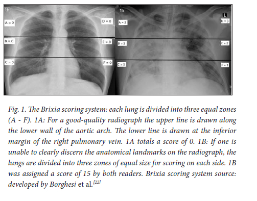

# Watching vimeo linked in 1 pager -> recording notes of features, insights, etc.

[Video](https://vimeo.com/843234440)

### SECTION GLOSSARY
- [List Exams](#list-exams-browser_urlexams--get-exams-list_examsjs)
- [View Single Exam](#view-single-exam-browser_urlget_examspatient_idexam_id---upon-user-clicking-exam-id-exam_id--get-exam_id-list_single_examjs)
- [Create Exam](#create-exam-browser_urlcreate_exam-post-exams-create_examjs)
- [Update/Delete Exam](#updatedelete-exam-browser_urlupdate_examexam_id-put-exam_id-update_examjs--browser_urldelete_examexam_id-delete-exam_id-delete_examjs)
- [View Single Patient](#view-single-patient-browser_urlget_patientpatient_id--get-patient_id-single_patientjs)
- [Admin Section](#only-admins-can-accessperform)
- [Search](#search)
- [Order Exam Information](#order-exams)

### SECTIONS
_*SG = STRETCH GOALS*_

#### (LIST EXAMS): `{browser_url}/exams/` [ GET /exams, list_exams.js]
- Contains Patient ID, Exam ID, Image, Key Findings, Brixia Score, Age, Sex, BMI, Zip Code (only read privileges for exams)
- Search bar for terms in key findings
- Nav bar containing Exams, Admin Routes

1. (RE1) when clicking on exam-id -> direct to singular exam

## ALL USERS CAN ACCESS/PERFORM

#### (VIEW SINGLE EXAM): `{browser_url}/get_exams/{patient_id}/{exam_id}` - upon user clicking exam id `{exam_id}` [ GET /exam_id, list_single_exam.js]
or
(based on video) `{browser_url}/get_exam/{exam_id}`
- I noticed there were exams with the same exam id under different patient ids so it has to be filter by patient -> filter by exam id -> get desired exam
    * Example @1:34 -> 1st, 3rd, 5th, 7th rows have the same exact id
    * one possible fix is to have the exam id randomized or use MongoDB's automated `_id`
        - this would allow for an ease of querying single exam -> `{browser_url}/get_exam/{_id}`
- (actually) the `exam id` is actually just the href content and the url seems to be `/exam/{random mongo _id}` @ 4:43

1. (RE1 - Redirect) now viewing singular exam
    - singular exam page has two sections being patient info, exam info
        * patient info: patient id, age, sex, bmi, zip code
        * exam info: exam id, image(url), image, date, key findings, brixia score (separated by commas)
            - Exam Url
                - Not sure if exam url is ideal to be included/maybe if done tastefully
            - Brixia Score
                - (description) as it turns out is a scoring system that communicates the changes in lung parenchyma, which is component of lungs involved in gas exchange
                    * higher scores corresponding to higher mortality
                    * 
                - (SG: improvement vs video) provide a method for doctors to interpret this score on the spot i.e given a provided score, doctors can press an interpret button and have advice/info about what said score means
            - SG: BMI: maybe provide interpretation below BMI as well

#### (VIEW SINGLE PATIENT): `{browser_url}/get_patient/{patient_id}` [ GET /patient_id, single_patient.js]
- Contains everything on list exams page for a particular patient as well as number of exams and that individual patient's id

#### (SEARCH)
- (based on video) Users are able to use search in order to get to perform filtering based on content in Key Findings section
    * query parameters
        - [purpose](https://stackoverflow.com/questions/30967822/when-do-i-use-path-params-vs-query-params-in-a-restful-api)
        - [using QPs](https://scientyficworld.org/how-to-use-query-parameters-with-react-router/)
    * (video showed) user inputted terms found in description of an exam and table filtered upon entering to get exam with desired description

### (ORDER EXAMS)
- (based on video) users can sort exams based on age, sex, bmi, zip code
    * ascending, descending on age, bmi, zip code
    * M to F on sex
    * filter based on chosen parameters for patients given booleans
        - Example: `patients.filter((patient)=> patient.age===21 && patient.sex === 'M')`

## ONLY ADMINS CAN ACCESS/PERFORM

### (ADMIN PAGE): `{browser_url}/admin` [admin.js] - only accessed by those with admin privileges as compared to regular users

- Contains everything on list exams page except for the image (for some reason) and has update, delete abilities (read and write privileges for exams)
- Upon delete or update, the website changes the get_exams view on admin and exams page i.e state is automatically fetched if changes made on admin page
    * __TESTING__
        * test fe in the instance an exam is deleted i.e rows shift up 1 or if exam is added shift rows down 1
        * test fe for exams page to be auto-updated when exam on admin page is deleted, updated

#### (CREATE EXAM): `{browser_url}/create_exam/` [POST /exams, create_exam.js]
- Contains patient info, exam info section like that of get single exam section as well as buttons: add exam, random exam (maybe for testing purposes -> generate a new exam on spot in order to see how it is reflected on fe), cancel button (stop add exam process)
    * __POTENTIAL IMPROVEMENTS__
        - Provide a scrollable list for doctors to pick a patient from that when hovering displays a clickable modal to view their info in fuller modal that pops out in front of form in the middle of screen
            - admin wants to create exam -> under select patient [list of patients] -> hover over patient name -> view preview -> click preview -> view all patient info if needed
            - have list have order, pagination options possibly
            * such an addition would fill in id, age, sex, bmi, zipcode for admin user

        - for image url, show a preview of images already stored or have a upload file (blob concerns) or at worst have it be type in url
            * it's really hard to remember a long url to enter in a form
        - Key Findings not KeyFindings (make this convert to auto bulleted list?)

#### (UPDATE EXAM): `{browser_url}/update_exam/{exam_id}` [PUT /exam_id, update_exam.js]
- Contains editable fields for each section for an exam -> confirm update button -> redirect to admin page

#### (DELETE EXAM):  `{browser_url}/delete_exam/{exam_id}` [DELETE /exam_id, delete_exam.js]
- Delete button or modal that allows users to perform DELETE Crud Op
    * press delete on report -> report disappears from table without window reload
